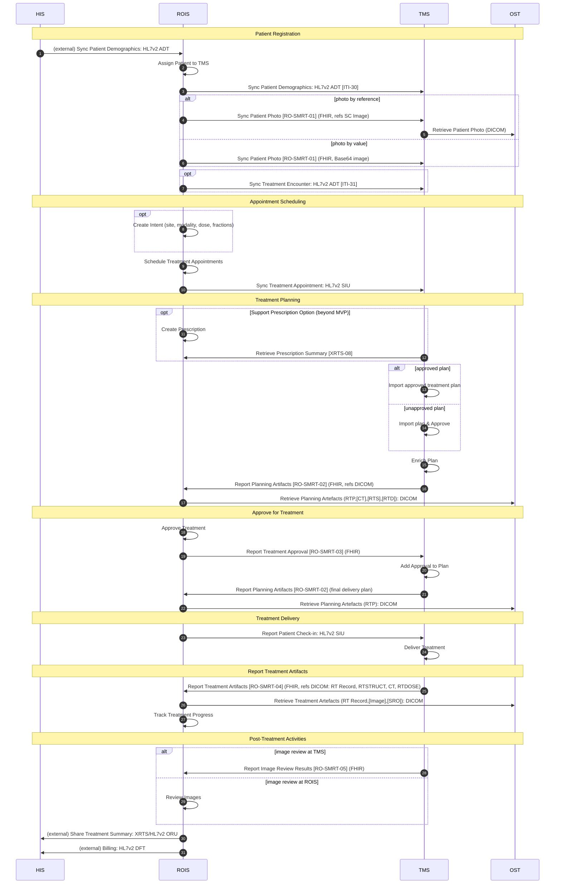

# IHE-RO Shared Management of Radiation Treatments (SMRT)

This repository contains the [IHE](https://www.ihe.net/) Radiation Oncology **Shared Management of Radiation Treatments (SMRT)** Profile, authored as a FHIR Implementation Guide using the [IG Publisher](https://confluence.hl7.org/display/FHIR/IG+Publisher+Documentation) and [SUSHI](https://fshschool.org/docs/sushi/).

> **Status:** Draft / work-in-progress (Phase 1 — MVP). Transaction identifiers, section numbers, and groupings are **provisional** pending assignment by the IHE-RO Technical Committee.

## Overview

In contemporary radiation oncology clinics, a single **Radiation Oncology Information System (ROIS)** manages the electronic medical record and is used to prescribe, schedule, and track each patient's course of treatment. Many treatment devices, however, interface only with a device-specific or embedded **Treatment Management System (TMS)** and end up as isolated "islands" that must be scheduled and tracked separately.

The SMRT Profile (a **Workflow and Content** profile) defines the exchanges needed to connect a device-specific TMS with a single departmental ROIS, so that standalone devices can be scheduled, reviewed, and tracked in the ROIS alongside the rest of the treatment device fleet.

## Actors

| Actor | Description |
|-------|-------------|
| **ROIS** | Radiation Oncology Information System — the central departmental system; authoritative record holder and treatment-approval gatekeeper. |
| **TMS** | Treatment Management System — a device-specific subsystem that coordinates planning and manages delivery, reporting status and artifacts back to the ROIS. |

The Hospital Information System (**HIS**) and the DICOM object store (**OST**) are external to the profile and shown for context.

## Transactions

The profile defines new **FHIR-message** transactions between the ROIS and TMS, and **reuses** established IHE transactions/standards (by grouping) for the rest.

**Defined by this profile:**

| ID | Transaction | Initiator → Responder |
|----|-------------|-----------------------|
| RO-SMRT-01 | Sync Patient Photo (by value, or by reference to a DICOM SC image) | ROIS → TMS |
| RO-SMRT-02 | Report Planning Artifacts (refs DICOM RT objects) | TMS → ROIS |
| RO-SMRT-03 | Report Treatment Approval | ROIS → TMS |
| RO-SMRT-04 | Report Treatment Artifacts (refs DICOM RT objects) | TMS → ROIS |
| RO-SMRT-05 | Report Image Review Results | TMS → ROIS |

**Reused by grouping:** patient demographics & encounter — IHE-ITI PAM `[ITI-30]`/`[ITI-31]` (HL7 V2 ADT); appointment scheduling & check-in — HL7 V2 SIU; prescription summary — IHE-RO XRTS `[XRTS-08]` (Support Prescription Option); artifact retrieval — DICOM C-MOVE/C-GET/QIDO-RS/WADO-RS.

## Workflow (Use Case #1: Shared Management of Treatment)

The process flow below is the Phase 1 (MVP) workflow agreed at the Shanghai F2F meeting, initiated by the ROIS. Messages shown in italics in the source are reused from other profiles/standards or are external to SMRT.



## Repository layout

| Path | Contents |
|------|----------|
| `input/pagecontent/` | Narrative pages: `index`, `volume-1` (actors, transactions, use case), `RO-SMRT-0x` (Volume 2 transaction details), `domain-ZZ` (Volume 3 content), `issues`. |
| `input/fsh/` | FSH source — ROIS/TMS requirements `CapabilityStatement`s and aliases. |
| `input/images-source/` | PlantUML sources for the actor diagram and interaction/process-flow diagrams (rendered to SVG by the IG Publisher). |
| `sushi-config.yaml` | IG configuration: pages, menu, dependencies, metadata. |

## Building

```sh
# Generate FHIR artifacts from FSH
npx fsh-sushi .

# Build the full IG (downloads the IG Publisher; requires Java)
./_updatePublisher.sh   # first time only, to fetch the publisher
./_genonce.sh           # build once  ->  output/index.html
```

## CI build

The continuous-integration build of the canonical IHE repository is published at
<https://build.fhir.org/ig/IHE/RO.SMRT/branches/master/index.html>.

## Authoring sources

The profile is authored from the IHE-RO SMRT working documents (supplement, transaction worksheet, the Shanghai F2F sequence diagram, and USCDI investigation) maintained in the project's Box workspace. The Mermaid diagram above mirrors the `input/images-source/usecase1-processflow.plantuml` swimlane used in the published IG.
